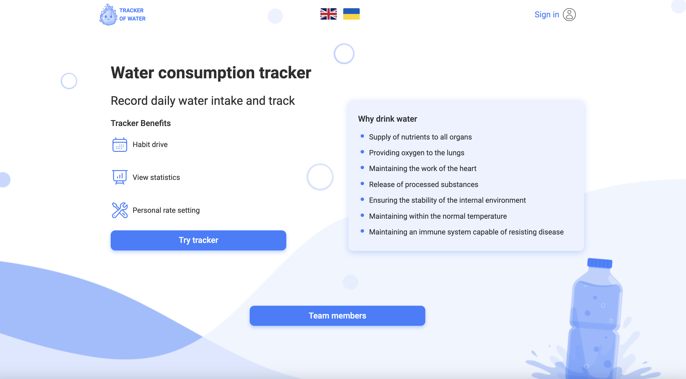
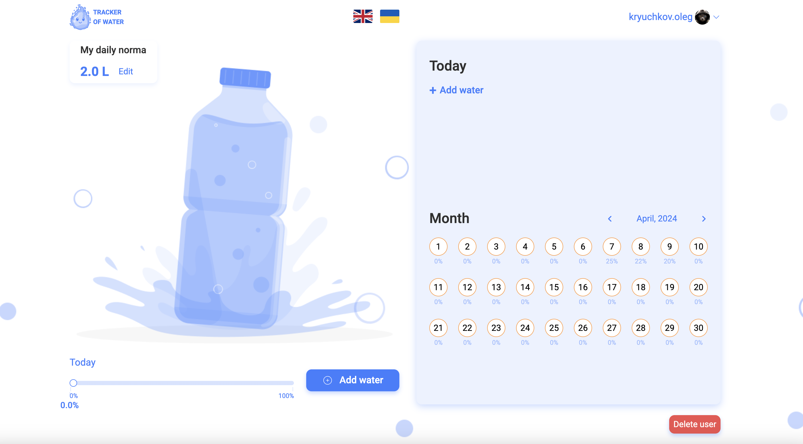

# **Water tracker**

WaterTracker - це веб-застосунок, який допомагає користувачам відстежувати свій водний баланс та рівень споживання питної води протягом дня та місяця.

## **Опис**

Наш застосунок дозволяє вам легко обчіслити щоденну норму споживання питної води та відстежувати свої показники протягом дня та місяця. Ось деякий функціонал:

+ Авторизація користувача: забезпечте безпеку та відстежуйте свої показники, увійшовши до облікового запису. На сайті також реалізована Google-авторизація. 

+ Додавання: просто додавайте події вживання питної води, вказуючи обʼєм.

+ Редагування: можливість редагувати і оновлювати вже існуючі події, а також видаляти за необхідності.

+ Оновлення та відновлення паролю користувача. 

+ При необхідності повне видалення користувача. 

## **Особливості**

+ Адаптивна верстка: веб-застосунок повністю адаптивний та оптимізований для відображення на різних пристроях, включаючи комп'ютери, планшети та смартфони.

+ Інтуїтивний інтерфейс: легкий у використанні інтерфейс дозволяє легко додавати та редагувати події без зайвих зусиль.

+ Мультимовність: застосунок реалізований в українській та англійській версії. 

## **Використані технології**

Frontend: 

Backend: 

Utilites: 

## **Посилання**

+ Репозиторій [Front-end](https://github.com/Stee1Lemon/water-tracker),

+ Репозиторій [Back-end](https://github.com/Marixa82/WaterTracker-t8-backend).

+ Документація [Swagger](https://watertracker-t8-backend.onrender.com/api-docs/#/).

## **Команда розробників**

+ VLADYSLAV GOLODNIUK - Team Lead Front End, [GitHub](https://github.com/Stee1Lemon).

+ MARYNA AKSAKOVA - Team Lead Back End, [GitHub](https://github.com/Marixa82).
  
+ OLEH KRIUCHKOV - Scrum Master, Front End developer, [GitHub](https://github.com/OlegKryuchkov).

+ ALINA TANTSURA - Back End developer, [GitHub](https://github.com/AlinaTantsura).

+ MAKSYM VYSOTSKYI - Back End developer, [GitHub](https://github.com/Needlife1).

+ YELYZAVETA SHATROVA - Front End developer, [GitHub](https://github.com/shtrvv).

+ VADYM STARYNETS - Front End developer, [GitHub](https://github.com/Debeluk).

+ IRYNA TOLOLO - Front End developer, [GitHub](https://github.com/iratololo).

+ KAMILA BOHDANOVA - Front End developer, [GitHub](https://github.com/Kamila0301).
  
+ OLHA BUZAK - Front End developer, [GitHub](https://github.com/Olha-buz).